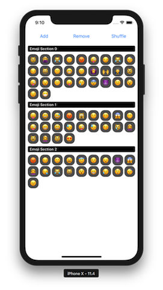

# EmojiCollection

This is [ReactComponentKit](https://github.com/ReactComponentKit/ReactComponentKit) example. EmojiCollection is built on Components, MVVM and Redux.

## Screenshot

## What is ReactComponentKit

ReactComponentKit is a library for building a UIViewController based on Component. Additionary, It architect UIViewController as Redux with MVVM. If you use ReactComponentKit, You can make many scenes(UIViewController) more easily. You can share components among scenes. 

## Using Diff algorithm for UICollectionView and UITableview

ReactComponentKit provides easy way to update UICollectionView and UITableView. Using diff, you can easily insert, delete or shuffle items like below :)

## MIT License

The MIT License

Copyright © 2018 Sungcheol Kim, https://github.com/ReactComponentKit/EmojiCollectionView

Permission is hereby granted, free of charge, to any person obtaining a copy
of this software and associated documentation files (the "Software"), to deal
in the Software without restriction, including without limitation the rights
to use, copy, modify, merge, publish, distribute, sublicense, and/or sell
copies of the Software, and to permit persons to whom the Software is
furnished to do so, subject to the following conditions:

The above copyright notice and this permission notice shall be included in
all copies or substantial portions of the Software.

THE SOFTWARE IS PROVIDED "AS IS", WITHOUT WARRANTY OF ANY KIND, EXPRESS OR
IMPLIED, INCLUDING BUT NOT LIMITED TO THE WARRANTIES OF MERCHANTABILITY,
FITNESS FOR A PARTICULAR PURPOSE AND NONINFRINGEMENT. IN NO EVENT SHALL THE
AUTHORS OR COPYRIGHT HOLDERS BE LIABLE FOR ANY CLAIM, DAMAGES OR OTHER
LIABILITY, WHETHER IN AN ACTION OF CONTRACT, TORT OR OTHERWISE, ARISING FROM,
OUT OF OR IN CONNECTION WITH THE SOFTWARE OR THE USE OR OTHER DEALINGS IN
THE SOFTWARE.
